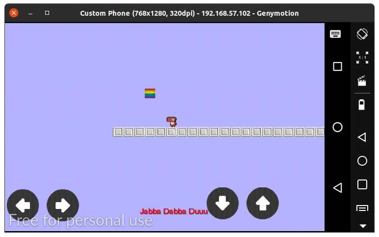
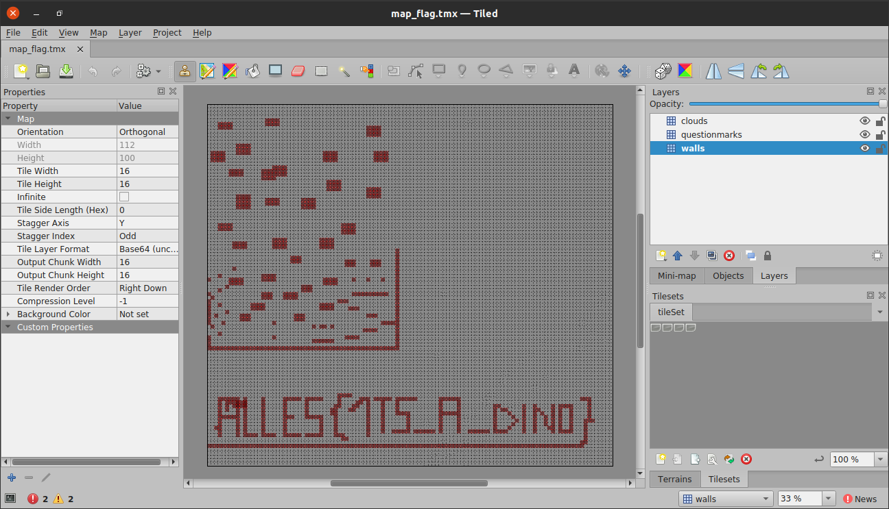

## ALLES! CTF

### prehistoric mario

In this challenge we are given a file `prehistoric-mario.apk`.  To know
what the app does, we can install it on our phone/emulator using adb.

```
$ adb install prehistoric-mario.apk
```


It is a platformer in which we walk around as a dinosaur and hit bricks
to change their colours. I will not focus much towards the actual game as
I solved this challenge outside of the game, however you can solve it by
hitting the bricks in a certain order within the game as well.

We can decompile this Android app using jadx. After browsing through the
source files for a while, we can see that the core game logic can be found
in `com.alles.platformer.MyPlatformer.java`

```
$ jadx prehistoric-mario.apk
$ cd prehistoric-mario/sources/com/alles/platformer
$ vi MyPlatformer.java
```

In this file there are a few important methods that I have surmised below:

- `create()`: sets up the stage for the game
- `checkFlag()`: checks the state of each brick, if it matches the solution state, the game map changes to show the flag
- `updateKoala()`: checks for user input and changes the state of the dino

In order to get to `checkFlag()` we need to satisfy a certain condition in
`updateKoala()`. That is, if we hit a certain brick whose "state" is 1337,
we execute the `checkFlag()` method. If it is not, then we just cycle the
brick through the following "states": 0, 21, 97 and 37. So whenever we hit
a brick, it keeps changing colour in a four-colour cycle.

```java
int intValue = ((Integer) cell2.getTile().getProperties().get("questionmarkType")).intValue();
if (intValue == 1337) {
    new Array();
    checkFlag();
} else {
    if (intValue == 0) {
        intValue = 21;
    } else if (intValue == 21) {
        intValue = 97;
    } else if (intValue == 97) {
        intValue = 37;
    } else if (intValue == 37) {
...
```



It turns out that 1337 is a special brick that we see when we jump across
the wall and reach a hidden section below our world. However, we wish to 
solve this without playing the game, so moving on to `checkFlag()` method.

```java
private void checkFlag() {
    MessageDigest messageDigest;
    int intValue;
    byte[] bArr = {0, 0, 0, 0, 0, 0, 0, 0, 0, 0, 0};
    TiledMapTileLayer tiledMapTileLayer = (TiledMapTileLayer) this.map.getLayers().get("questionmarks");
    int i = 0;
    int i2 = 0;
    while (i < 100) {
        int i3 = i2;
        for (int i4 = 0; i4 < 100; i4++) {
            TiledMapTileLayer.Cell cell = tiledMapTileLayer.getCell(i, i4);
            if (!(cell == null || !cell.getTile().getProperties().containsKey("questionmarkType") || (intValue = ((Integer) cell.getTile().getProperties().get("questionmarkType")).intValue()) == 1337)) {
                bArr[i3] = (byte) intValue;
                i3++;
            }
        }
        i++;
        i2 = i3;
    }
...
```

In the beginning of the method, we run a 100 * 100 loop going through each
tile in our world. We check if the tile is a question mark type tile and
if it is, we store its state (0, 21, 97 or 37) in an array called `bArr`. 

```java
try {
    messageDigest = MessageDigest.getInstance("SHA-256");
} catch (NoSuchAlgorithmException e) {
    e.printStackTrace();
    messageDigest = null;
}
messageDigest.update(bArr);
messageDigest.update("P4ssw0rdS4lt".getBytes());
if (toHex(messageDigest.digest()).equals("024800ace2ec394e6af68baa46e81dfbea93f0f6730610560c66ee9748d91420")) {
```

Once `bArr` is populated, we hash it along with the given salt and check
if it matches the solution state of bricks. So essentially, we need to
find out the states of the bricks that make `bArr` emit this particular
hash. Since we have just four states per brick, brute forcing is feasible
(since we have 4^11 possible values for `bArr`).

```java
import java.math.BigInteger;
import java.security.MessageDigest;

class brute {

    public static void main(String args[]) {
        byte[] p = {0,21,97,37};
        for (byte i=0; i<=3; ++i) {
        for (byte j=0; j<=3; ++j) {
        for (byte k=0; k<=3; ++k) {
        for (byte l=0; l<=3; ++l) {
        for (byte m=0; m<=3; ++m) {
        for (byte n=0; n<=3; ++n) {
        for (byte o=0; o<=3; ++o) {
        for (byte t=0; t<=3; ++t) {
        for (byte q=0; q<=3; ++q) {
        for (byte r=0; r<=3; ++r) {
        for (byte s=0; s<=3; ++s) {

        try {
            MessageDigest messageDigest;
            byte[] bArr = {p[i], p[j], p[k], p[l], p[m],
                p[n], p[o], p[t], p[q], p[r], p[s]};
                messageDigest = MessageDigest.getInstance("SHA-256");
            messageDigest.update(bArr);
            messageDigest.update("P4ssw0rdS4lt".getBytes());
            if (toHex(messageDigest.digest()).equals("024800ace2ec394e6af68baa46e81dfbea93f0f6730610560c66ee9748d91420")) {
                System.out.println(p[i] + " " + p[j] + " " + p[k] + " " + p[l] + " " + p[m] + " " + p[n] + " " + p[o] + " " + p[t] + " " + p[q] + " " + p[r] + " " + p[s] + " ");
                System.exit(0);
            }
        } catch(Exception e) {};

        }}}}}}}}}}}
    }

    public static String toHex(byte[] bArr) {
        BigInteger bigInteger = new BigInteger(1, bArr);
        return String.format("%0" + (bArr.length << 1) + "x", bigInteger);
    }
}
```

Above, I've written a Java program to bruteforce the hash.

```
$ javac brute.java
$ java brute
21 0 97 37 21 37 37 97 97 37 21
```

Once we run the bruteforce program, we get the value of `bArr` and now if
we want, we can go around the game putting each brick in its corresponding
state and get the flag. However, we can also reverse the rest of the
method and see what it does.

```java
...
if (toHex(messageDigest.digest()).equals("024800ace2ec394e6af68baa46e81dfbea93f0f6730610560c66ee9748d91420")) {
    try {
        messageDigest.update(bArr);
        messageDigest.update("P4ssw0rdS4lt".getBytes());
        messageDigest.update(bArr);
        byte[] digest = messageDigest.digest();
        byte[] decode = Base64Coder.decode(Gdx.files.internal("flag_enc").readString());
        SecretKeySpec secretKeySpec = new SecretKeySpec(digest, 0, digest.length, "RC4");
        Cipher instance = Cipher.getInstance("RC4");
        instance.init(2, secretKeySpec, instance.getParameters());
        String str = new String(instance.doFinal(decode));
        FileHandle local = Gdx.files.local("map_flag.tmx");
        local.writeString(str, false);
        Gdx.files.local("tileSet.png").writeBytes(Base64Coder.decode(/* a very long string */), false);
        TmxMapLoader tmxMapLoader = new TmxMapLoader(new LocalFileResolver());
                tmxMapLoader.getDependencies(BuildConfig.FLAVOR, local, (BaseTmxMapLoader.Parameters) null);
                AssetManager assetManager = new AssetManager(new LocalFileResolver());
                assetManager.load("tileSet.png", Texture.class);
                assetManager.finishLoading();
                tmxMapLoader.loadAsync(assetManager, "map_flag.tmx", local, (TmxMapLoader.Parameters) null);
                this.map.dispose();
                this.map = tmxMapLoader.loadSync((AssetManager) null, (String) null, (FileHandle) null, (TmxMapLoader.Parameters) null);
                this.renderer = new OrthogonalTiledMapRenderer(this.map, 0.0625f);
            } catch (Exception e2) {
                e2.printStackTrace();
            }
        }
```

Once we get the hash, we base64 decode the contents of an internal file
called `flag_enc`. After decoding, we also need to decrypt the file using
`bArr` that we calculated earlier. Once the file is decrypted, we can see
that it is written to `map_flag.tmx` and loaded into the world. So I wrote
a script by mostly copying the decompiled code and got the decrypted map
file that will be shown to us if we succeed within the game.

```java
import java.security.MessageDigest;
import java.math.BigInteger;
import javax.crypto.Cipher;
import javax.crypto.spec.SecretKeySpec;
import java.util.Base64;
import java.nio.file.Files;
import java.nio.file.Path;
import java.nio.file.Paths;

class idk {
    public static void main(String args[]) {
        try {
            byte[] bArr = {21, 0, 97, 37, 21, 37, 37, 97, 97, 37, 21};
            MessageDigest messageDigest;
            messageDigest = MessageDigest.getInstance("SHA-256");
            messageDigest.update(bArr);
            messageDigest.update("P4ssw0rdS4lt".getBytes());

            if (toHex(messageDigest.digest()).equals("024800ace2ec394e6af68baa46e81dfbea93f0f6730610560c66ee9748d91420"))
            {
                messageDigest.update(bArr);
                messageDigest.update("P4ssw0rdS4lt".getBytes());

                messageDigest.update(bArr);
                byte[] digest = messageDigest.digest();
                Path filePath = Paths.get("flag_enc");
                String content = Files.readString(filePath);
                byte[] decoded = Base64.getDecoder().decode(content);
                SecretKeySpec secretKeySpec = new SecretKeySpec(digest, 0, digest.length, "RC4");
                Cipher instance = Cipher.getInstance("RC4");
                instance.init(2, secretKeySpec, instance.getParameters());
                String str = new String(instance.doFinal(decoded));
                System.out.println(str);
            }
        } catch(Exception e) {};
    }

    public static String toHex(byte[] bArr) {
        BigInteger bigInteger = new BigInteger(1, bArr);
        return String.format("%0" + (bArr.length << 1) + "x", bigInteger);
    }
}
```

The above code will stream the decoded map file into stdout so we can
capture it as follows.

```
$ javac idk.java
$ java idk > map_flag.tmx
```

Once we have the tmx file, we can open it using
[Tiled](https://www.mapeditor.org/).



And we get the flag: `ALLES{1TS_A_DINO}`

